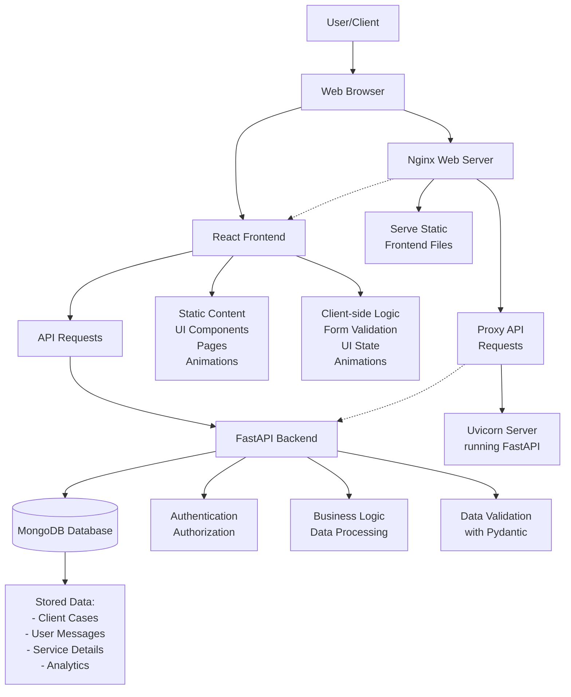

# Widia Application Architecture

## Application Flow Diagram



## Why Backend and MongoDB are Needed

### Backend (FastAPI) Purpose
The backend provides necessary functionality that cannot be implemented in a frontend-only application:

1. **Secure Data Processing**: Handling sensitive operations server-side prevents exposing business logic to clients
2. **API Integration**: Centralized interface for third-party services and APIs
3. **Authentication & Authorization**: Secure user authentication and permission management
4. **Data Validation**: Ensures data integrity before storage
5. **Business Logic**: Complex processing that shouldn't be exposed to client-side

### MongoDB Database Role
MongoDB was chosen as the database for several key reasons:

1. **Flexible Document Structure**: Ideal for storing varied content types (case studies, service offerings, contact information)
2. **Scalability**: Horizontally scalable to handle growing data and traffic
3. **Rich Querying**: Supports complex queries for filtering and searching content
4. **Schema Evolution**: Adapts easily as data requirements change over time
5. **Fast Development**: Works well with JavaScript objects through JSON-like documents

## Current Implementation State

### MongoDB Current Usage
The current implementation has a minimal MongoDB integration with a single collection:

```python
# Status Check model - Currently the only data being stored
class StatusCheck(BaseModel):
    id: str = Field(default_factory=lambda: str(uuid.uuid4()))
    client_name: str
    timestamp: datetime = Field(default_factory=datetime.utcnow)
```

The database currently stores:
- **Status Checks**: Simple monitoring entries containing:
  - Unique ID (UUID)
  - Client name
  - Timestamp (when the check occurred)

### Planned Future Data Storage
While the current implementation is minimal, the architecture is set up to support storing:
- Client case studies and references
- Contact form submissions
- Service details and offerings
- User interaction analytics
- Content management data

This foundation allows for incremental expansion of data storage capabilities as the application grows.